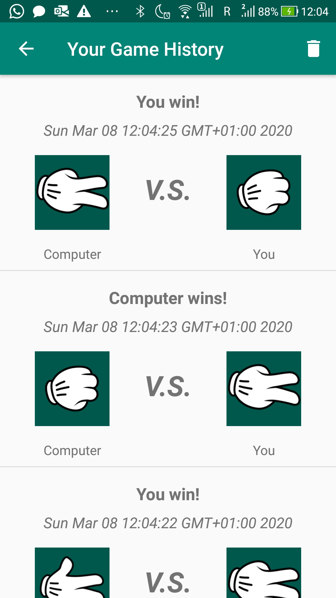

# Level 4 Learning Task 2 - Rock, Paper, Scissors
This is the second learning task of the fourth level. This task was more challenging than the previous ones since we had to combine many of the skills obtained from the previous tasks, including creating new activities, working with the Room database, RecyclerView list, and more.
## What's inside
This is an app in which you can play rock, paper, scissors with the computer. The user can select out of three images to make his/her move (rock , paper, scissors). When a user has made their move it’s visualized which move they made and which move the computer made. The result (win, lose, draw) is displayed. Every game played is stored in a Room database. The game history is displayed. The user should is able to clear the game history.
Also, there is statistics displayed of how many wins, draws and losses the user has. Whenever a user plays, the statistics is updated. When the game history is cleared then the statistics is cleared.
## Screenshots
    

    
